# Memento

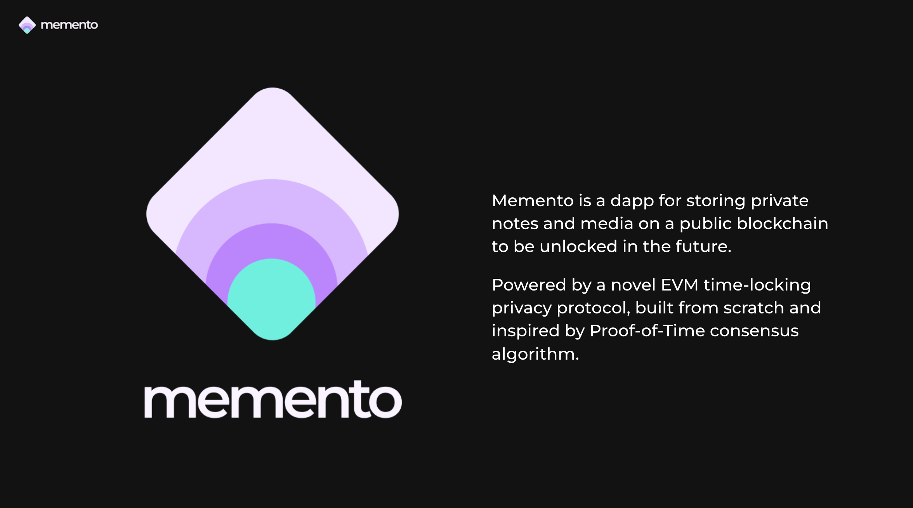

## Introduction

Welcome to Memento, a decentralized time-capsule platform built for the Ethereum ecosystem. As an entry to the ETH Global 2023 Istanbul Hackathon, Memento represents a novel approach to private, delayed sharing of notes and media on the blockchain.

Memento leverages Ethereum's smart contracts to allow users to securely store messages and data, making them accessible only when certain conditions are met. This could be a predefined time period, a lack of proof of life, and other customizable triggers.

Video demo: https://youtu.be/ZcFMCZaePcc

## Use Cases

Memento opens up a plethora of possibilities:

- **Inheritance Wills**: Securely store wills for future disclosure.
- **Education**: Teachers can schedule course materials for future release.
- **Business**: Schedule the release of vested stocks or confidential documents.
- **Event Promotion**: Create suspense and traction with timed reveals of secrets or announcements.

## How It Works

### Creating a Memento

1. **Upload and Lock**: Users upload their notes and documents, set a release date, and seal them with a cryptographic signature.
2. **Storage and Payment**: The sealed Memento is stored on IPFS, and users pay a transaction fee proportional to the lock duration.
3. **Sharing**: Users can share a Memento link and an unlock password with the intended recipient.

### Under the Hood

- **Encryption**: Data is encrypted before being broadcast on the blockchain.
- **Secret Sharing**: A secret key is shared with the recipient to decrypt the data at the right time.
- **Verifiable Delay Function (VDF)**: A puzzle that takes a predetermined time to solve is generated. The solution to this puzzle is the private key needed to unlock the Memento.

### Solvers

Memento relies on a network of Solvers who work on computing the time-lock puzzles. Solvers are incentivized through bounties proportional to the time spent solving these puzzles.

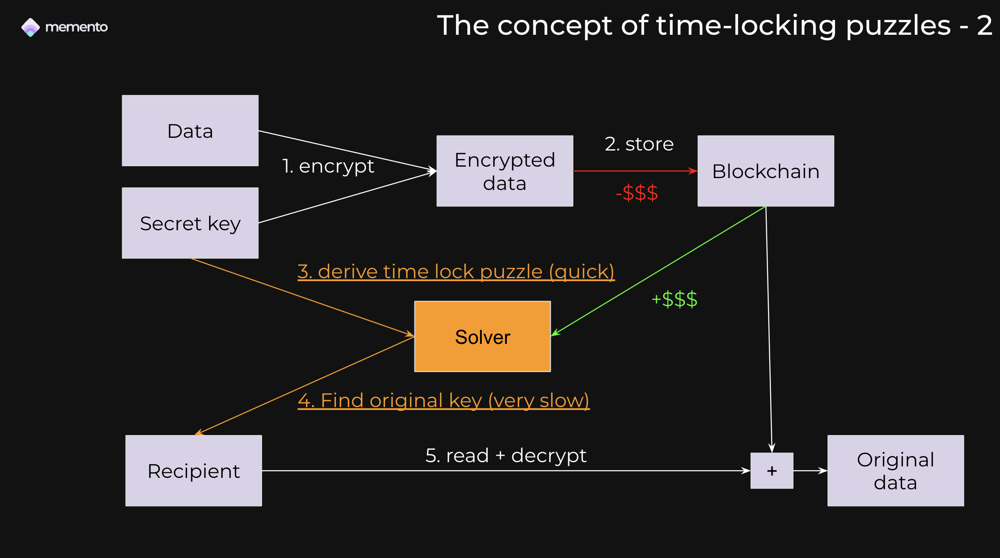
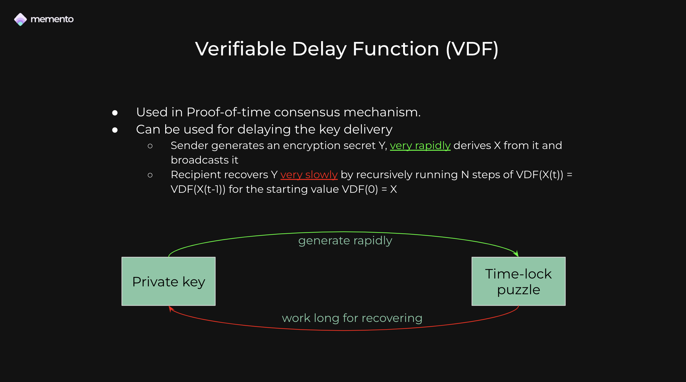
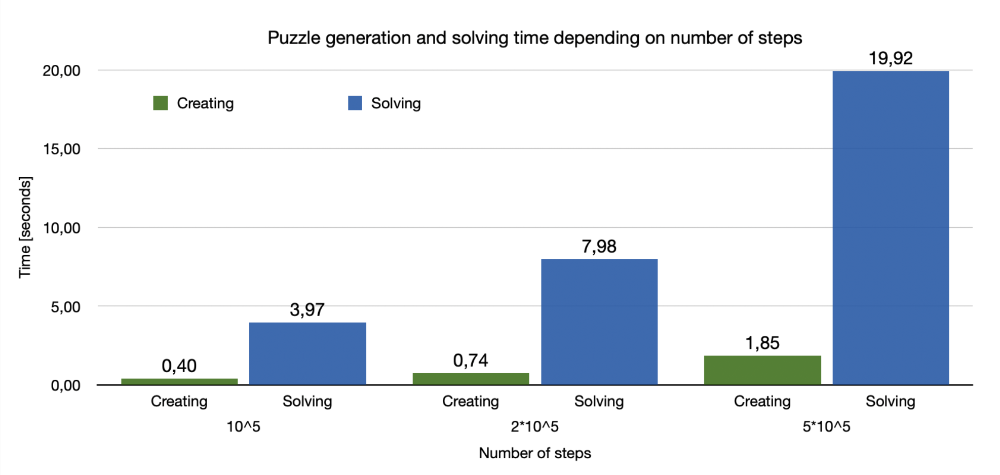

## Screenshots

### Memento Interface
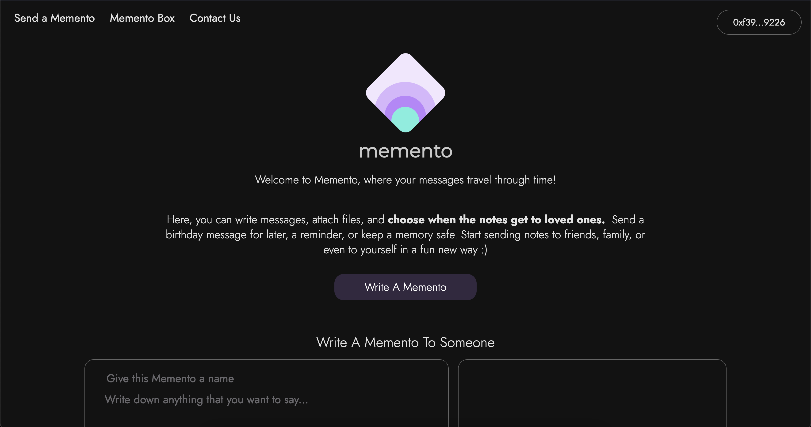

### Creating a Memento
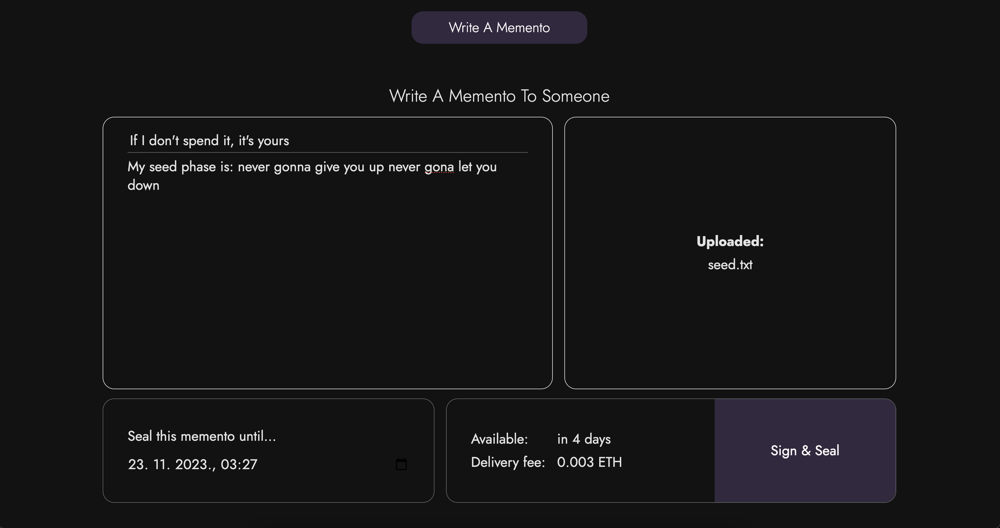
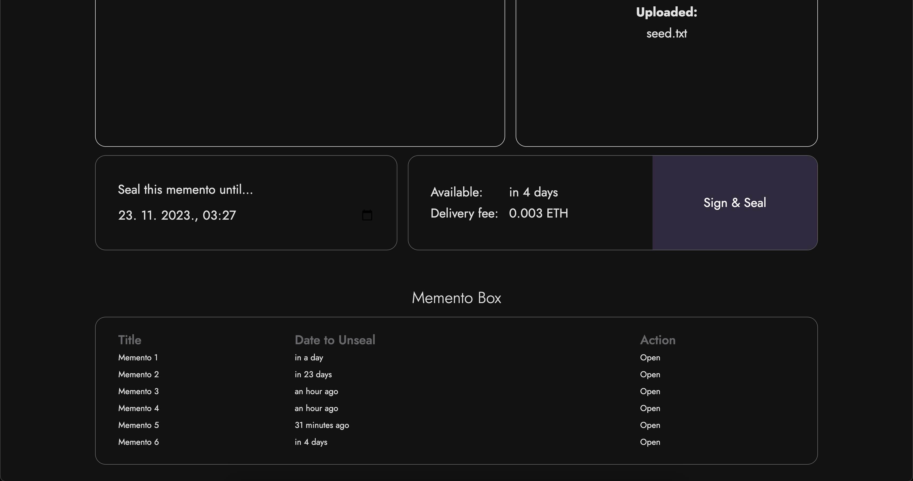
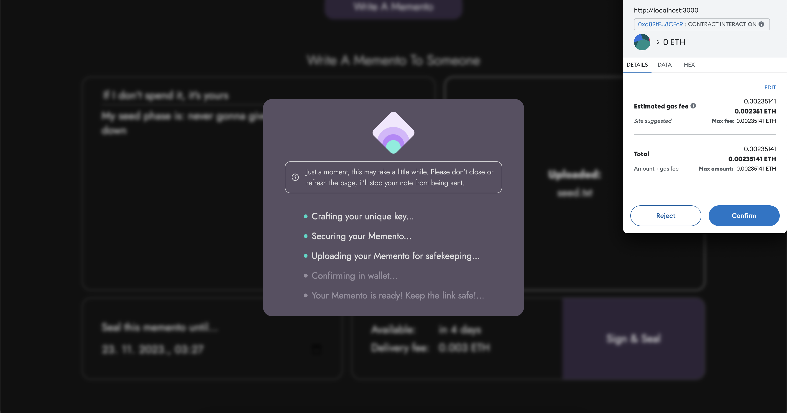
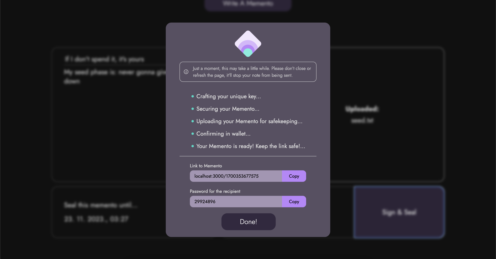

### Viewing a Memento
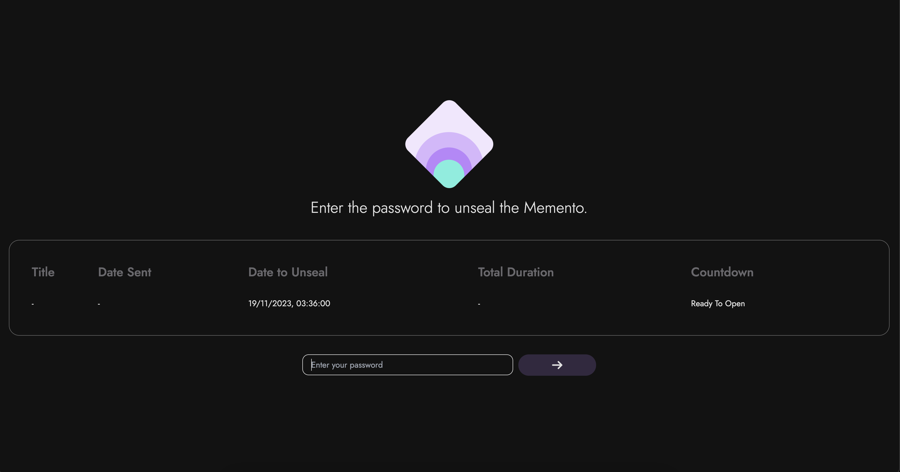
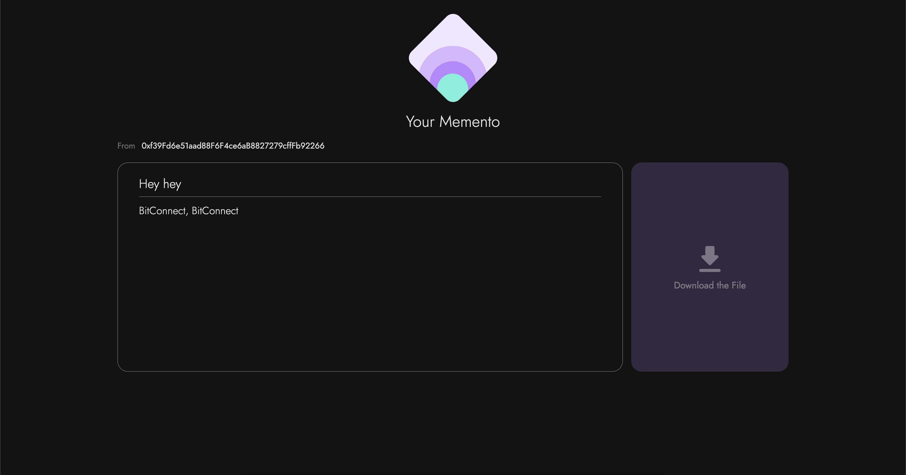

## Roadmap

- **Smart Contract**: Developed and deployed on Scroll EVM.
- **Frontend**: Deployed on BOS.
- **Time-Lock Protocol**: Fully implemented, excluding Solver rewards.
- **Ethereum Improvement Proposal (EIP)**: Submitted for community consideration.

# Deployments / Bounties

## Chiliz contract address

0xCf7Ed3AccA5a467e9e704C703E8D87F634fB0Fc9

## Scroll contract address

0xa82ff9afd8f496c3d6ac40e2a0f282e47488cfc9

## Linea contract address

0x922D6956C99E12DFeB3224DEA977D0939758A1Fe

## WalletConnect

Used Web3Modal.

## Filecoin

Used web3storage/nftstorage.

## Acknowledgements

Thank you for your interest in Memento! We hope our project inspires more privacy-preserving applications on the Ethereum blockchain.

---

ETH Global 2023 Istanbul Hackathon Entry
